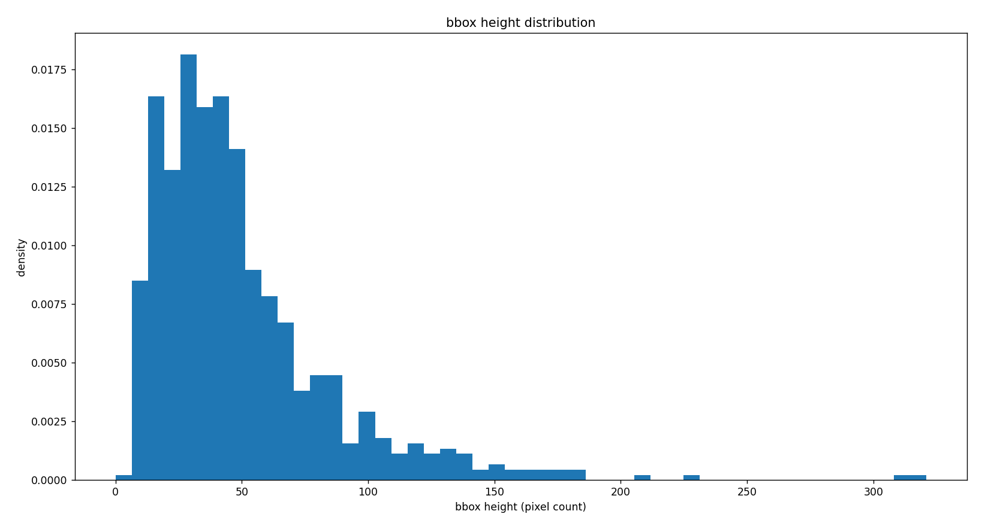
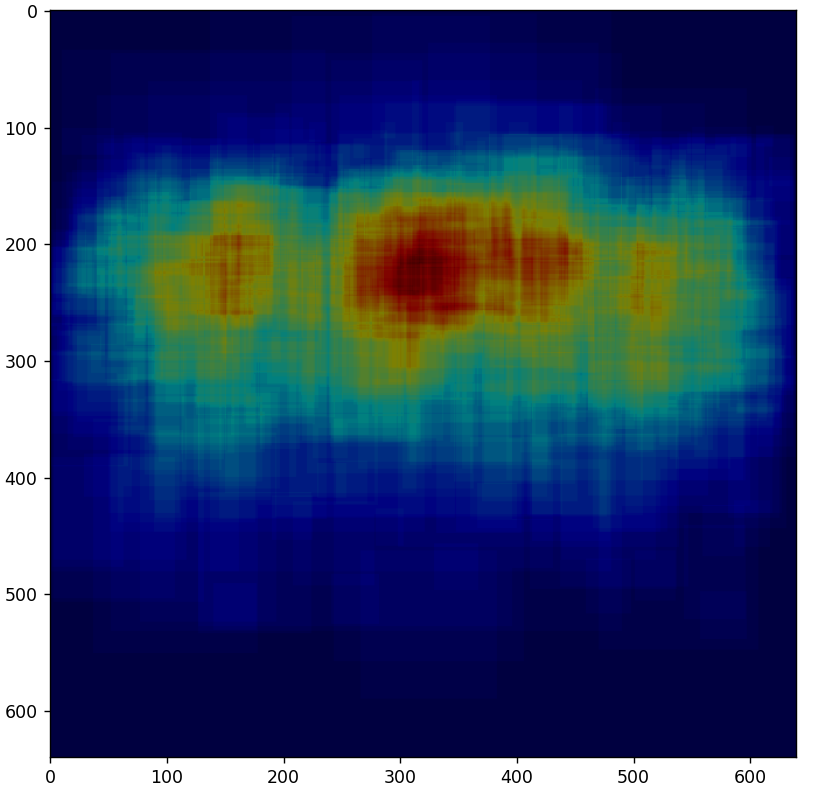
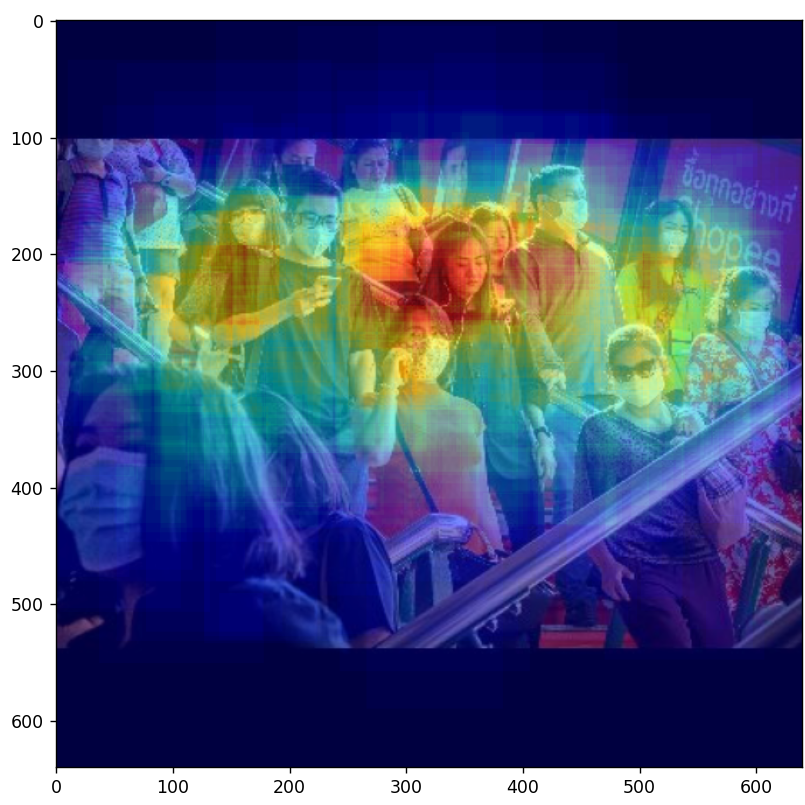

# 分析目标框分布规律

主要内容是：对目标检测数据集进行分析，统计目标框的高度、长宽比分布直方图，以及以用热力图的形式，展现目标框所处图像的位置，主要是前期对数据集的统计分析，而且生成出来的图比较好看，看起来高级，实现很简单。

不去讲解理论，直接上代码，在实践中学习

需要提前说明的是：数据集是目标检测数据集YOLO格式，

数据集文件

```python
|-dataset
|----images
|--------train
|--------val
|----labels
|--------train
|--------val
|-draw_heatmap.py
|-heightHist.py
```


## 目标框长宽比、高度分布直方图

下面代码都有注释就不在具体说明，比较容易看懂的，看不懂也是可以直接拿过来用

```python
import os
import matplotlib.pyplot as plt
from PIL import Image

def read_yolo_label_file(file_path, img_width, img_height):
    with open(file_path, 'r') as f:
        lines = f.readlines()
        labels = []
        for line in lines:
            parts = line.strip().split(' ')
            bbox_height = float(parts[4]) * img_height
            bbox_width = float(parts[3]) * img_width
            label = {
                'class': parts[0],
                'x_center': float(parts[1]),
                'y_center': float(parts[2]),
                'width': float(parts[3]),
                'height': float(parts[4]),
                'pix_width': float(bbox_width),
                'pix_height': float(bbox_height)
            }
            # 计算bbox高度的像素点数
          
            labels.append(label)
        return labels
def get_image_size_from_label(label_file_path):
    # 获取图像文件路径
    img_file_path =  os.path.splitext(label_file_path)[0] + '.jpg'
    img_file_path = img_file_path.replace("labels","images")
    # 读取图像文件
    with Image.open(img_file_path) as img:
        # 获取图像尺寸
        img_width, img_height = img.size
    return img_width, img_height

def plot_bbox_height_distribution(yolo_label_files):
    heights = []
    for file in yolo_label_files:
        img_width, img_height = get_image_size_from_label(file)
        labels = read_yolo_label_file(file, img_width, img_height)
        for label in labels:
            bbox_height = label['pix_height']
            heights.append(bbox_height)
    # 绘制直方图
    plt.hist(heights, bins=50, density=True)
    plt.xlabel('bbox height (pixel count)')
    plt.ylabel('density')
    plt.title('bbox height distribution')
    plt.show()

def plot_bbox_aspect_ratio_distribution(yolo_label_files):
    aspect_ratios = []
    for file in yolo_label_files:
        img_width, img_height = get_image_size_from_label(file)
        labels = read_yolo_label_file(file, img_width, img_height)
        for label in labels:
            if label['pix_width'] == 0:
                continue
            aspect_ratio = label['pix_height']/label['pix_width']
            aspect_ratios.append(aspect_ratio)
    # 绘制直方图
    plt.hist(aspect_ratios, bins=50, density=True)
    plt.xlabel('bbox height (pixel count)')
    plt.ylabel('density')
    plt.title('bbox height distribution')
    plt.show()

def plot_bbox_distribution_for_dataset(data_dir):
    label_files = [os.path.join(data_dir, f) for f in os.listdir(data_dir) if f.endswith('.txt')]
    plot_bbox_height_distribution(label_files)
    plot_bbox_aspect_ratio_distribution(label_files)

data_dir = './mask2/labels/train'
plot_bbox_distribution_for_dataset(data_dir)

```

绘制的直方图纵坐标density表示什么意思？在统计学中，"density"通常是指频率的比率，即一个事件在一个特定时间间隔内发生的次数，除以该时间间隔的总长度。在这个情境下，纵坐标"density"可以理解为每个高度值（横坐标值）所占的相对频率。在绘制直方图时，纵坐标"density"通常是通过将每个条形高度值（横坐标值）除以数据总数和条形的宽度来计算的，以确保总面积等于1。因此，"density"可以反映每个高度值在整个数据集中所占的比例。简单来说 就是这一个高度的数量，占据总样本量的比重


**结果展示**



**额外探索了其他的写法，这里以长宽比直方图为例子**

长宽比的部分代码自己又重写了几个版本吧，可供参考

**这样直方图的精度就是0.1 为什么直方图的精度不一样？**

直方图的精度决定了直方图中每个条带的宽度，而每个条带所代表的数据范围是由条带的起始值和终止值决定的。在统计目标框高度分布时，我们将高度值分成了100个条带，每个条带宽度为1。而在统计目标框纵横比分布时，我们将纵横比值分成了100个条带，每个条带宽度为0.1。这是因为目标框高度的值范围一般比纵横比要大，因此需要分成更多的条带才能更准确地描述数据分布情况。

**版本1**

这里把纵坐标设为这一个bin的数量占总的数量的比例，跟直接将density设为True生成的不太一样，不知道那里出现问题

```python
import os
import cv2
import numpy as np
import matplotlib.pyplot as plt

label_dir = './mask2/labels/train'
img_dir = './mask2/images/train'
aspect_ratio_bins = np.arange(0, 5, 0.05)

aspect_ratios = []
for label_file in os.listdir(label_dir):
    with open(os.path.join(label_dir, label_file), 'r') as f:
        for line in f.readlines():
            label = line.strip().split()
            class_id, x_center, y_center, width, height = map(float, label[0:5])
            img_file = os.path.join(img_dir, os.path.splitext(label_file)[0] + '.jpg')
            print(img_file)
            img = cv2.imread(img_file)
            img_height, img_width, _ = img.shape
            bbox_height, bbox_width = height * img_height, width * img_width
            if bbox_width == 0:
                continue
            aspect_ratio = bbox_height / bbox_width
            aspect_ratios.append(aspect_ratio)

aspect_ratios = np.array(aspect_ratios)
hist, bin_edges = np.histogram(aspect_ratios, bins=aspect_ratio_bins)
# print(hist)
# print(bin_edges)
fig, ax = plt.subplots(figsize=(10, 5))
ax.bar(bin_edges[:-1], hist/sum(hist), width=0.1)
ax.set_xlabel('Aspect Ratio')
ax.set_ylabel('Probability')
ax.set_title('Aspect Ratio Distribution')
plt.show()

```

**版本二**

```python

import os
import cv2
import numpy as np
import matplotlib.pyplot as plt

# 数据集文件夹情况为图片一个文件夹images，标签文件一个文件夹labels
label_dir = './mask2/labels/train'
img_dir = './mask2/images/train'

aspect_ratios = []

# 遍历标签文件夹中所有标签文件
for label_file in os.listdir(label_dir):
    if not label_file.endswith(".txt"):
        continue

    # 读取标签文件中的目标框信息
    with open(os.path.join(label_dir, label_file), "r") as f:
        lines = f.readlines()
  
    # 遍历目标框信息中所有目标框
    for line in lines:
        # 将目标框信息解析为坐标和类别信息
        parts = line.strip().split(" ")
        class_id = int(parts[0])
        x, y, w, h = map(float, parts[1:])
    
        # 计算目标框的长宽比
        if h == 0:
            continue
        aspect_ratio = w / h
        aspect_ratios.append(aspect_ratio)

# 绘制长宽比直方图
plt.hist(aspect_ratios, bins=100, range=(0, 5), density=True)
plt.xlabel("Aspect Ratio")
plt.ylabel("Probability")
plt.show()

```

**结果展示**


## 目标框分布热力图

**该代码的主要思路是：**

1. 设置热力图的大小和精度，并初始化热力图。
2. 遍历标签文件夹，对于每一个标签文件，读取对应的图片文件，获取其宽高，然后读取标签文件中的标注框位置信息。
3. 将每个标注框的位置映射到热力图上，使用热度值来记录每个位置上出现的标注框数量。
4. 将热力图标准化到[0, 1]范围内，并使用颜色编码表示热度值。
5. 将热力图和原始图像叠加在一起，将结果显示出来。

具体实现上，该代码使用了Python中的os、cv2和matplotlib库。在遍历标签文件夹时，读取每个标签文件的内容，并将每个标注框的位置信息映射到热力图上，使用numpy数组进行操作。最后，该代码使用opencv库将热力图转换成RGB格式，并将热力图和原始图像叠加在一起。最终结果使用matplotlib库展示出来。

下面代码都有注释就不在具体说明，比较容易看懂的，看不懂也是可以直接拿过来用

```python
import os
import cv2
import numpy as np
import matplotlib.pyplot as plt

# 数据集路径
dataset_path = r"./mask2"
image_folder = os.path.join(dataset_path, "images/train")
label_folder = os.path.join(dataset_path, "labels/train")

# 设置热力图大小和精度
heatmap_size = (640, 640)
heatmap_precision = 4

# 初始化热力图
heatmap = np.zeros(heatmap_size, dtype=np.float32)
i=1
# 遍历标签文件夹，计算每个标注框的位置
for label_file in os.listdir(label_folder):

    print("label_file",label_file)
    print(i)
    i+=1
    label_path  = os.path.join(label_folder,label_file)
    # 获取图片文件名
    image_file = label_file.replace(".txt", ".jpg")
    image_path = os.path.join(image_folder,image_file)
    print(image_path)
    # 读取图片，获取宽高
    image = cv2.imread(image_path)
    image_height, image_width, _ = image.shape
    # 读取标签文件，获取标注框位置
    with open(os.path.join(label_folder, label_file), 'r') as f:
        for line in f.readlines():
            line = line.strip().split()
            x_center = float(line[1]) * image_width
            y_center = float(line[2]) * image_height
            width = float(line[3]) * image_width
            height = float(line[4]) * image_height
            # 将标注框位置映射到热力图上
            x1 = int(max(0, (x_center - width / 2) * heatmap_size[0] / image_width))
            y1 = int(max(0, (y_center - height / 2) * heatmap_size[1] / image_height))
            x2 = int(min(heatmap_size[0] - 1, (x_center + width / 2) * heatmap_size[0] / image_width))
            y2 = int(min(heatmap_size[1] - 1, (y_center + height / 2) * heatmap_size[1] / image_height))
            # 更新热力图
            heatmap[y1:y2+1, x1:x2+1] += 1

# 将热力图标准化到[0, 1]
heatmap /= np.max(heatmap)

# 将热力图转换成RGB格式
heatmap_rgb = cv2.applyColorMap(np.uint8(heatmap*255), cv2.COLORMAP_JET)

# 将热力图和原图叠加在一起
# image = cv2.imread(os.path.join(image_folder, os.listdir(image_folder)[0]))
# image = cv2.resize(image,(640,640))

#设置纯黑色的背景进行叠加
image = np.zeros((heatmap_size[0], heatmap_size[1], 3), dtype=np.uint8)
image[:, :] = (0, 0, 0)


print(heatmap_rgb.shape)
print(image.shape)
heatmap_with_image = cv2.addWeighted(heatmap_rgb, 0.5, image, 0.5, 0)

# 显示热力图和原图叠加在一起的结果
plt.imshow(cv2.cvtColor(heatmap_with_image, cv2.COLOR_BGR2RGB))
plt.show()

```

**设置精度是干什么用的？**

在热力图中，精度是指网格的大小，即每个网格代表的像素数。设置精度的主要目的是为了平衡可视化效果和计算量，使得热力图的信息呈现更加精细，同时计算速度更快。具体来说，当精度较低时，热力图的信息可能会过于模糊，反之，当精度过高时，计算量会变得非常大，严重影响程序的运行效率。因此，需要在可视化效果和计算速度之间进行平衡，选择一个合适的精度。通常来说，选择合适的精度需要根据具体的应用场景和数据特点来进行调整。

**结果展示**

以黑色为底图，叠加热力图



以图片为底图


